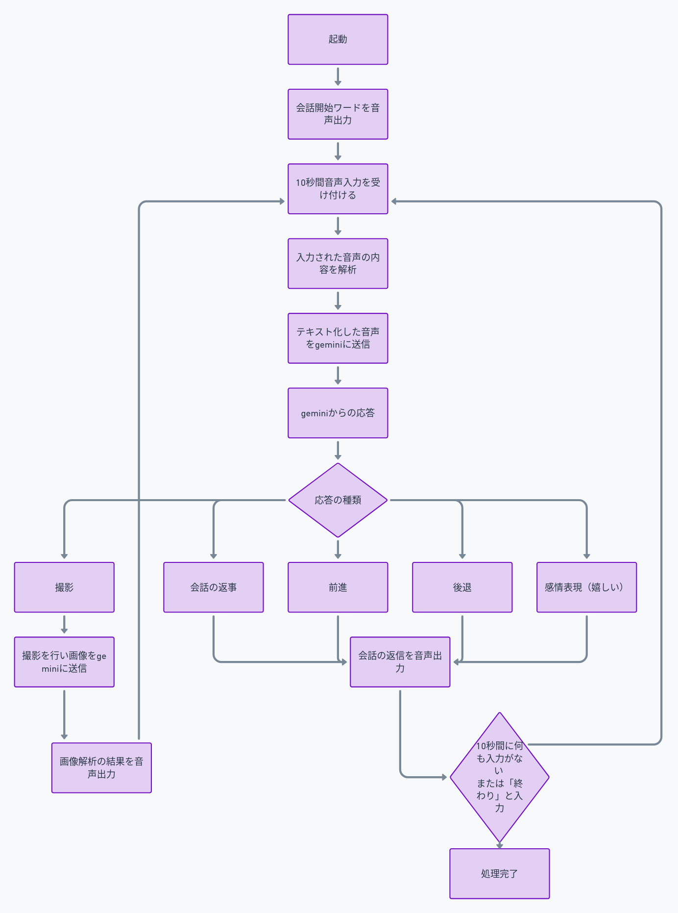

# 手作りAIロボット動作プログラム

## 動作環境
- RaspberryPi 3B 1G OS:bookwarm
- タミヤロボットカー工作キット(https://www.tamiya.com/japan/products/70227/index.html)
- モーター制御チップ(L293D)
- USBマイク
- アンプ
- モバイルバッテリー(高出力対応)
- 電池(単三電池x2,9V電池x1)

## 利用API
- google text to speech
- google speech to text
- google gemini1.5 flash

ラングチェインを使用しているので、gpt-4への切り替えは簡単にできます。

## 機能
- 音声チャット
- 音声チャット応じて、前進、後退（嬉しい時は、前後に動く）
- 音声チャット応じて、カメラを起動して撮影した内容で応答を返す

## 利用方法
python環境

必要モジュールのインストール
`pip install requirementx.txt`

実行
`python main.py`

## 動作

動作動画

## 動作フロー
動作の流れは以下です。

